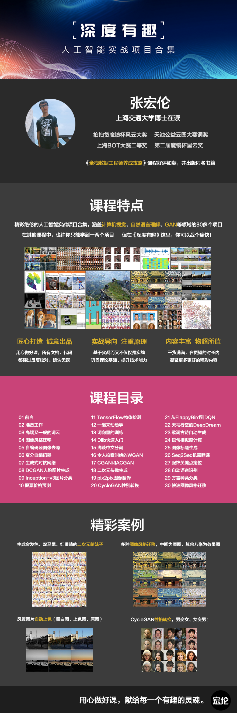

# DeepInterests

### 深度有趣 - 人工智能实战项目合集

使用Python3、TensorFlow1.9和Keras2.2，课程介绍文章，[https://zhuanlan.zhihu.com/p/34744472](https://zhuanlan.zhihu.com/p/34744472)。

- Github项目：[https://github.com/Honlan/DeepInterests](https://github.com/Honlan/DeepInterests)，包括182页的课程说明文档pdf；
- 项目网盘：[https://pan.baidu.com/s/1zQRTR5X9JVUxQKNUZxyibg](https://pan.baidu.com/s/1zQRTR5X9JVUxQKNUZxyibg)，包括数据和代码，分为完整版和精简版两个版本，前者包括项目所涉及的完整内容，后者只包括最后执行所需的必要文件；
- 知乎专栏：[https://zhuanlan.zhihu.com/DeepInterests](https://zhuanlan.zhihu.com/DeepInterests)，包括在线版的文档和代码；
- 付费视频：[https://study.163.com/course/courseMain.htm?courseId=1004777011](https://study.163.com/course/courseMain.htm?courseId=1004777011)，让你更好、更快、更轻松、更全面的掌握每一个项目。

献给每一个有趣的灵魂。

### 课程特点

- 精彩绝伦的实战项目合集；
- 匠心打造、诚意出品；
- 开源！开源！开源！

### 前置课程

- 《Python基础入门》：[https://study.163.com/course/courseMain.htm?courseId=1005461017](https://study.163.com/course/courseMain.htm?courseId=1005461017)，我出的Python入门课，面向零编程基础的同学，主要讲解Python核心语法；
- 《深度学习微专业》，[https://mooc.study.163.com/smartSpec/detail/1001319001.htm](https://mooc.study.163.com/smartSpec/detail/1001319001.htm)，吴恩达老师出的深度学习理论课，内容全面而有深度，对掌握深度学习各方面理论知识很有帮助；
- 《全栈数据工程师养成攻略》：[https://study.163.com/course/courseMain.htm?courseId=1003520028](https://study.163.com/course/courseMain.htm?courseId=1003520028)，我出的Python实战课，从采集、存储、分析和可视化等角度讲解如何用Python实现一些数据项目，有助于提升个人编程能力。

### 课程目录

01. 前言
02. 准备工作
03. 高端又一般的词云
04. 图像风格迁移
05. 自编码器图像去噪
06. 变分自编码器
07. 生成式对抗网络
08. DCGAN人脸图片生成
09. Inception-v3图片分类
10. 股票价格预测
11. TensorFlow物体检测
12. 一起来动动手
13. 词向量的训练
14. Dlib快速入门
15. 浅谈中文分词
16. 令人拍案叫绝的WGAN
17. CGAN和ACGAN
18. 二次元头像生成
19. pix2pix图像翻译
20. CycleGAN性别转换
21. 从FlappyBird到DQN
22. 天马星空的DeepDream
23. 歌词古诗自动生成
24. 语句相似度计算
25. 图像标题生成
26. Seq2Seq机器翻译
27. 服饰关键点定位
28. 自动语音识别
29. 方言种类分类
30. 快速图像风格迁移
